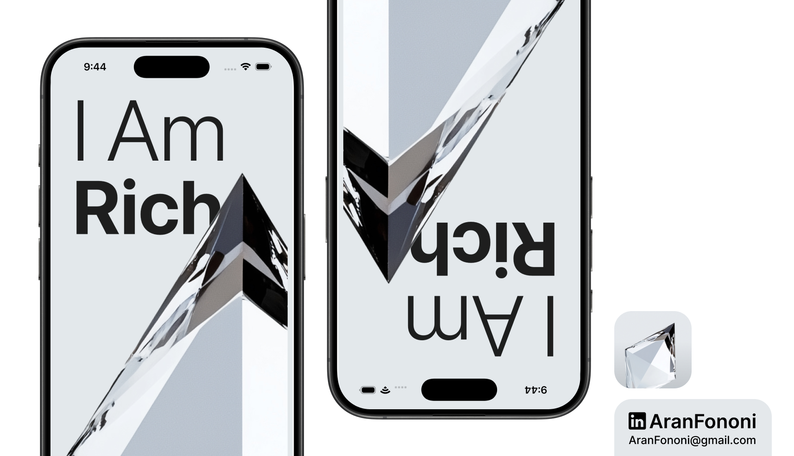

# I Am Rich

### Project for Section 2: **Introduction to iOS Development**  
This project was completed as part of Section 2 in the **Complete iOS Development Bootcamp** by Angela Yu.

## Project Overview
**I Am Rich** is a minimalistic app that displays a wealth-inspired message, marking an early step in understanding iOS development. This project provided a solid foundation in the iOS development setup, building a simple interface, and familiarizing with Xcode tools.

## What I Learned
Through this project, I achieved the following:
- **Xcode Navigation**: Learned to navigate Xcode’s Interface Builder, adding and configuring elements.
- **ViewController Basics**: Understood the structure of a `UIViewController` and its role in the app.
- **UI Placement & Design**: Positioned UI elements like labels and images to design a static display.
- **Running Simulations**: Tested the app in the iOS Simulator to verify the layout and design.

## Key Skills
- Xcode Setup & Interface Builder Basics
- Positioning UI Elements
- Running iOS Simulations

---

### Project Preview

---

### Footer

---

## Contact
For more information, feel free to reach out:  
- **Email**: [aranfononi@gmail.com](mailto:aranfononi@gmail.com)  
- **LinkedIn**: [Aran Fononi](https://www.linkedin.com/in/aran-fononi-18182b265)
